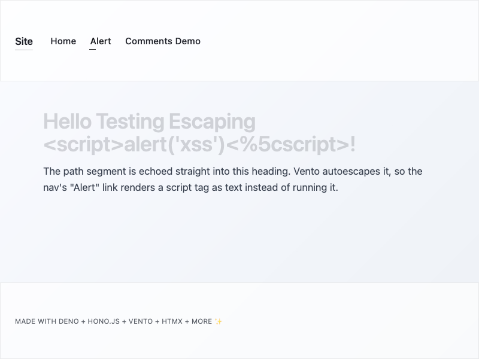
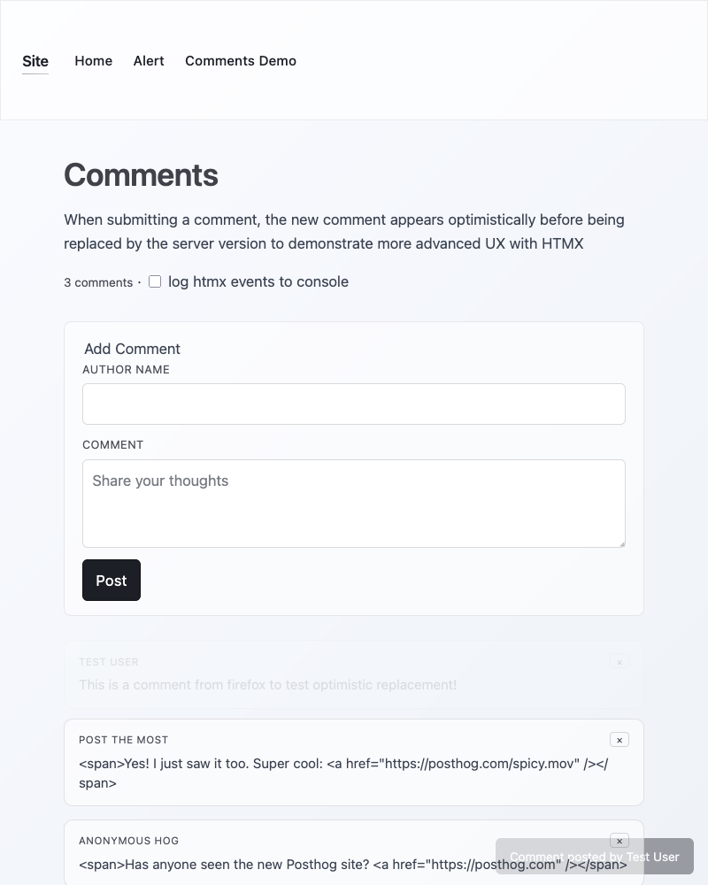

# app-template-demo

The runnable demo for [app-template](../../README.md), generated by `ctt` and then extended with an htmx comments feature that the template itself does not ship.

Everything here except the files listed under [Demo-only files](#demo-only-files) is regenerated from `app_template/` on every `mise run ctt`, so this directory doubles as a review diff for template changes and as a working app.

## Run it

```sh
mise install
deno install
mise run build
deno task dev # http://localhost:8080
```

## Screenshots

### Home Page



### Comments Page



## Demo-only files

The template never emits these, so ctt leaves them alone:

- `src/partials/` — the comments router and its in-memory store
- `src/templates/pages/comments.vto` and `src/templates/partials/comment*.vto`
- `shared/commentShape.ts` — isomorphic input shaping, transpiled to `public/shared/` for the browser
- `styles/components/comment.css`
- `tests/e2e/comments.spec.ts`, `tests/e2e/xss.spec.ts`, `src/routes_test.ts`

Four more files are seeded by the template but protected by `_skip_if_exists`, so the demo keeps its own versions: `README.md`, `src/routes.ts`, `src/templates/pages/home.vto`, and `src/templates/partials/nav.vto`.

## What the demo shows

The comments page exercises htmx beyond a plain swap:

- optimistic insert from a `<template>` clone, replaced on `htmx:afterSwap` by matching `data-temp-id`
- `hx-swap-oob` to keep the comment count in sync from an unrelated response
- `HX-Trigger` response header driving a toast, so other listeners can react to the same event
- `htmx:confirm` intercepted to replace `window.confirm()` with a click-again-to-confirm delete
- `hx-sync="this:drop"` and `closest li:abort` to drop duplicate submits and cancel superseded deletes
- Vento autoescaping, via the nav's "Alert" link that puts a `<script>` tag in the URL
