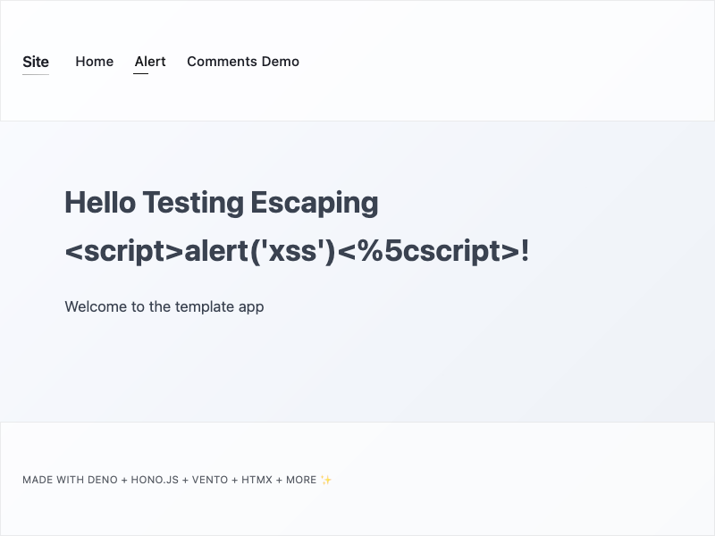
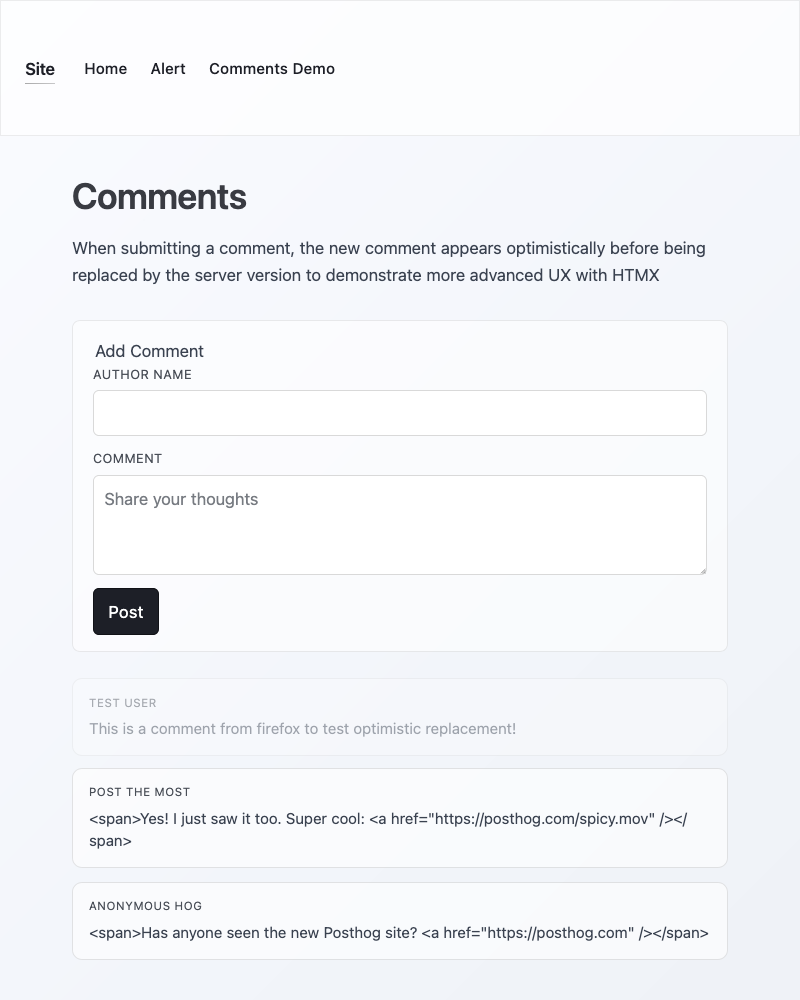

# App Template

A simplified Deno web application built with Hono (API), Vento (templating), and HTMX (AJAX interactivity). Used to experiment with sharing JS between client and server and managing CSS without a framework or React.

## Screenshots

### Home Page



### Comments Page



## Setup

```sh
mise install
deno install
hk install
deno task test:e2e:install
mise run build
```

## Development

```sh
mise watch build # Keeps built files up to date
mise watch dev --restart |& tail-jsonl # Hot reloads on TS changes, while mise watches .vto. Optionally run with `pipx:tail-jsonl`

deno task test:watch

hk run pre-commit --all
```

## Production

```bash
deno task prod # Serves production app from built executable
```

## Environment Variables

See [./src/utils/env.ts](./src/utils/env.ts) for configuration options:

- `NODE_ENV` - Environment mode (development/production/test)
- `PORT` - Server port (default: 8080 dev, 8000 prod)
- `HOST` - Server host (default: localhost dev, 0.0.0.0 prod)
- `LOG_LEVEL` - Logging level (trace/debug/info/warning/error/fatal)

## Security

This template includes security best practices:

- **XSS Protection**: Vento templating with `autoescape: true` enabled
- **Security Headers**: CSP, X-Frame-Options, X-Content-Type-Options, etc.
- **Asset Integrity**: SHA-256 verification for external dependencies
- **Input Validation**: Zod schemas for runtime type checking

See [SECURITY.md](./SECURITY.md) for details.

## Architecture

```
src/
  ├── api.ts              # API routes
  ├── app.ts              # Main application & middleware
  ├── partials/           # HTMX partial routes & stores
  ├── templates/          # Vento templates (.vto files)
  └── utils/              # Utilities (env, errors, etc.)
shared/                   # Code shared between server & client
scripts/                  # Build scripts
tests/                    # Tests (unit & e2e)
```
